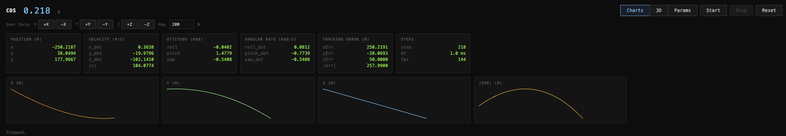
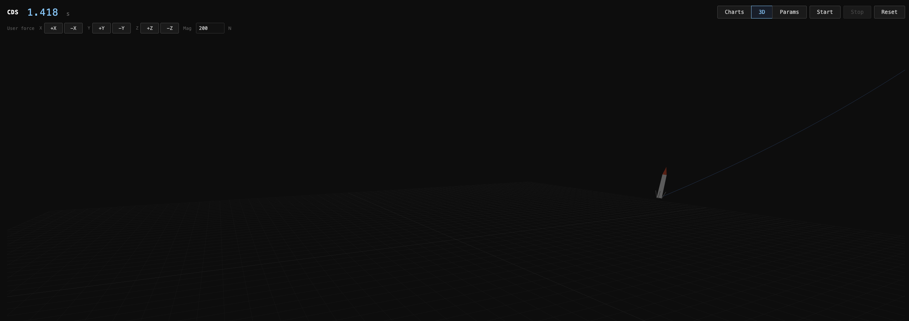
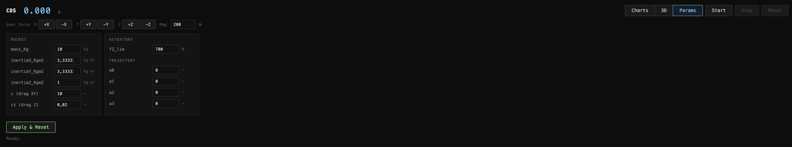

# Controlled Descent Simulator

A real-time, interactive simulator of a **powered rocket descent** (SpaceX Falcon 9 style), built with a C++ physics core compiled to **WebAssembly** and a vanilla JS frontend. Runs entirely in the browser — no server required.

**[Live Demo](https://diego-perazzolo.github.io/Controlled-Descent-Simulator/frontend/)**


---

## Project Scope

Simulate the controlled descent of a single-stage rocket booster in 3D, with:
- A **dynamics modeling notebook** written in iPython
- A **physics core** written in C++20, compiled to `.wasm` via Emscripten
- A **plain HTML/JS frontend** for real-time visualization, parameter configuration, and interactive control
- Full deployment on **GitHub Pages** 

---

## Features

### Frontend

- **Charts view** — real-time strip charts for x, y, z position and position error magnitude
- **3D view** — Three.js scene with rocket mesh (body + nose cone + landing legs), trajectory trail, orbital camera (orbit / pan / zoom)
- **Params tab** — edit all physical and trajectory parameters at runtime; Apply & Reset re-initializes the core without reloading the page
- **User force buttons** — six hold-to-apply buttons (±X, ±Y, ±Z) inject external perturbation forces into the simulation at every step; force magnitude is configurable
- **Simulation controls** — Start / Stop / Reset
- **Live simulation time** display

### Core (C++ → WebAssembly)

#### Communication Layer (`ext/`)
- `ext_init(params)` — initializes rocket parameters, actuator limits, and trajectory
- `ext_step(stepParams)` — advances one integration step; returns full state and tracking error
- `ext_getTrajectoryPoint(timeInstant)` - provides a point along the reference trajectory, used for trajectory preview
- Emscripten `embind` bindings expose all structs and functions to JavaScript

#### Physics Engine
- **6 DOF rigid body dynamics** (3 translational + 3 rotational)
- State: position `(x, y, z)`, linear velocity `(ẋ, ẏ, ż)`, Euler angles `(roll, pitch, yaw)`, angular rates
- Forces: main thrust, gravity, aerodynamic drag (parametric coefficients `c`, `cz`), user-injected perturbations
- ODE integration: **Runge-Kutta 4 (RK4)**
- Parametric controller (LQR / PID — switchable)

### Screenshots

| Charts view | 3D view | Params view |
|:-----------:|:-------:|:-------:|
|  |  |  |

---

## Software Architecture

```
┌─────────────────────────────────────────────────────────┐
│                  FRONTEND (HTML + JS)                   │
│                                                         │
│  ┌─────────────┐  ┌─────────────┐  ┌─────────────────┐  │
│  │ Charts view │  │   3D view   │  │   Params tab    │  │
│  │  (canvas)   │  │ (Three.js)  │  │  (form + Apply) │  │
│  └──────┬──────┘  └──────┬──────┘  └────────┬────────┘  │
│         └────────────────┼─────────────────┘           │
│               renderers[].update(state, err)           │
└───────────────────────────┬─────────────────────────────┘
                            │  ext_init() / ext_step()
                            ▼
┌─────────────────────────────────────────────────────────┐
│                   SIMULATOR (.wasm)                     │
│                                                         │
│  ┌───────────────────────────────────────────────────┐  │
│  │           ext/ — Communication Layer              │  │
│  │   embind bindings · struct conversion · errors    │  │
│  └──────────────────────┬────────────────────────────┘  │
│                         │                               │
│  ┌──────────────────────▼────────────────────────────┐  │
│  │              Core Physics (C++)                   │  │
│  │  ┌──────────┐   ┌────────────┐   ┌────────────┐   │  │
│  │  │  Model   │   │ Controller │   │ Trajectory │   │  │
│  │  │  6 DOF   │   │  LQR/PID   │   │    law     │   │  │
│  │  └──────────┘   └────────────┘   └────────────┘   │  │
│  └───────────────────────────────────────────────────┘  |
│                         │                               │
│  ┌──────────────────────▼────────────────────────────┐  │
│  │                   Dynamics                        │  │
│  │  ┌──────────┐   ┌────────────┐   ┌────────────┐   │  │
│  │  │  Jupyter │   │ Generated  │   │ Controller │   │  │
│  │  │ notebook │   │    C++     │   │   design   │   │  │
│  │  └──────────┘   └────────────┘   └────────────┘   │  │
│  └───────────────────────────────────────────────────┘  |
│                                                         | 
└─────────────────────────────────────────────────────────┘
```

---

## Physics Model

### Degrees of Freedom
6 DOF rigid body:
- **Translational**: X, Y, Z position and velocity in inertial frame
- **Rotational**: roll, pitch, yaw (Euler angles) and angular rates

### State
```
x, y, z          — position (m)
x_dot, y_dot, z_dot   — linear velocity (m/s)
roll, pitch, yaw      — Euler angles (rad)
roll_dot, pitch_dot, yaw_dot  — angular rates (rad/s)
```

### Forces and Torques
- Main thrust applied at configurable offset from CoM
- Gravity: `F_g = m·g` along −Z
- Aerodynamic drag: lateral coefficient `c`, axial coefficient `cz`
- External perturbations: user-injected force vector `(fX, fY, fZ)`

### Integration
Runge-Kutta 4 (RK4), fixed step `dt`.

### Controller
Hardcoded LQR on tracking error, and Feed Forward on all actuators

---

## Core API

```cpp
// Initialize simulation
bool ext_init(ext_initParams params);

// Advance one integration step
ext_stepRet ext_step(ext_stepParams params);

// Get a point at time instant t along the trajectory
ext_trajectoryPoint ext_getTrajectoryPoint(ext_coord_t t);
```


### Key types
```cpp
ext_rocketParams    { mass_Kg, inertiaX/Y/Z_Kgm2, c, cz }
ext_actuatorLimits  { fZ_lim }
ext_traj            { a0, a1, a2, a3 }
ext_userForce       { fX, fY, fZ }
ext_fullState       { x, y, z, x_dot, y_dot, z_dot,
                      roll, pitch, yaw, roll_dot, pitch_dot, yaw_dot }
ext_setpointError   { xErr, yErr, zErr }
```

---

## Tech Stack

| Layer | Technology |
|---|---|
| Modeling | Python |
| Dynamics | C++20 |
| Physics core | C++20 |
| WASM compilation | Emscripten (`emcc`) |
| JS bindings | Emscripten `embind` |
| Frontend | Vanilla HTML + JS (ES modules) |
| 3D rendering | Three.js |
| Build | CMake |
| Deployment | GitHub Pages |

---

## Repository Structure

```
/
├── core/
│   ├── CMakeLists.txt
│   ├── core.hpp / core.cpp                     # C-style public interface (stubs → impl)
│   ├── core_defs.hpp                           # Internal type definitions
│   ├── Models/
│   │   ├── BaseModel.hpp / BaseModel.cpp       # Abstract model base
│   │   └── Rocket.hpp / Rocket.cpp             # Concrete 6 DOF rocket model
│   ├── Trajectory/
│   │   ├── Trajectory.hpp / Trajectory.cpp     # CDS::Trajectory — reference law
│   │   └── Poly4.hpp / Poly4.cpp               # 4th order polynomial trajectory
│   └── ext/
│       ├── ext_defs.hpp                        # External struct definitions
│       ├── ext_comm.hpp / ext_comm.cpp         # Adapter layer (ext ↔ core)
│       └── bindings.cpp                        # Emscripten embind bindings
│
├── modeling/
│   ├── requirements.txt                        # Python requirements
│   ├── venv/                                   # Python virtual environment (gitignored)
│   └── notebooks/
│       ├── 01_model_derivation.ipynb           # Rocket dynamics with LQR + FF for trajectory tracking
│       ├── descent_codegen.py                  # Codegen helpers used by the notebook
│       └── exported_cpp/
│           └── dynamics_ff_lqr_01.cpp / .hpp   # Generated LQR + FF dynamics
│
├── frontend/
│   ├── index.html
│   └── main.js                                 # Simulation loop, renderers, UI logic
│
├── .github/
│   └── workflows/
│       └── deploy.yml                          # GitHub Pages CI/CD
│
└── Readme.md
```

---

## Prerequisites

| Tool | Version | Notes |
|------|---------|-------|
| [Emscripten SDK](https://emscripten.org/docs/getting_started/downloads.html) | 3.1.56+ | Provides `emcmake` / `emcc` |
| CMake | 3.15+ | Build system |
| Python 3 | any | Local dev server |

## Build & Run

### Compile the core (WebAssembly)

If necessary configure the environment with:

```bash
source pathToEmSDK/emsdk_env.sh
```

**Debug** (with source maps for local development):

```bash
emcmake cmake -S core -B build -DCMAKE_BUILD_TYPE=Debug
cmake --build build
```

**Release** (optimised, no debug symbols):

```bash
emcmake cmake -S core -B build -DCMAKE_BUILD_TYPE=Release
cmake --build build
```

### Run the frontend locally

From the project root:

```bash
python3 -m http.server 8080
```

Then open `http://localhost:8080/frontend/` in the browser.

### GitHub Pages

The repository includes a GitHub Actions workflow ([`.github/workflows/deploy.yml`](.github/workflows/deploy.yml)) that automatically builds the WASM in Release mode and deploys to GitHub Pages on every push to `main`.

To enable it:
1. Go to **Settings > Pages** in your GitHub repository
2. Set **Source** to **GitHub Actions**

---

## Roadmap

- [x] Architecture design
- [x] Communication layer (`ext/`) with embind bindings
- [x] Plain HTML/JS frontend — charts, 3D view, params tab, force buttons
- [x] Three.js 3D scene — rocket mesh + trajectory trail + OrbitControls
- [x] C++ core: 6 DOF model + RK4 integrator
- [x] C++ core: LQR controller
- [ ] Customizable trajectory
- [ ] C++ core: PID controller
- [x] GitHub Pages deployment (CI/CD workflow)
- [ ] Quaternion rotation support (future)
- [ ] DAE solver (future)

---

## Author

Diego Perazzolo

Co-Authored-By: Claude AI (mainly frontend, docs and VS Code Setup)
---

## License

MIT — see [LICENSE](LICENSE) for details.
