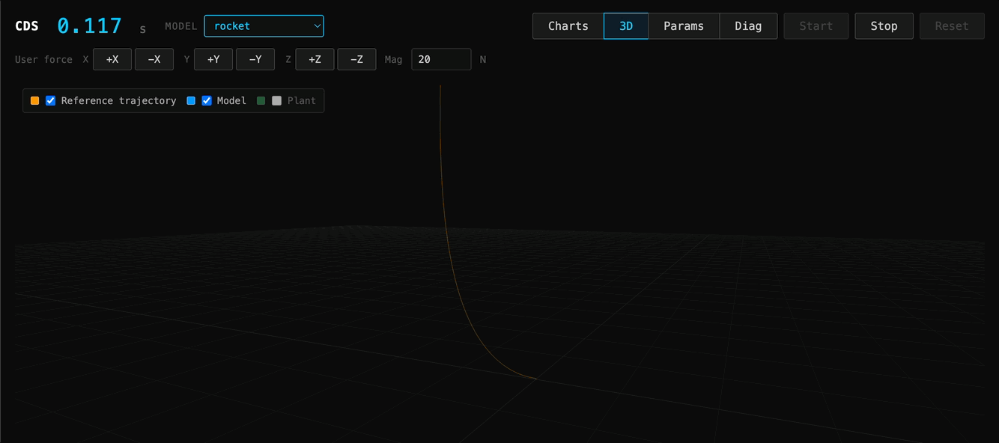
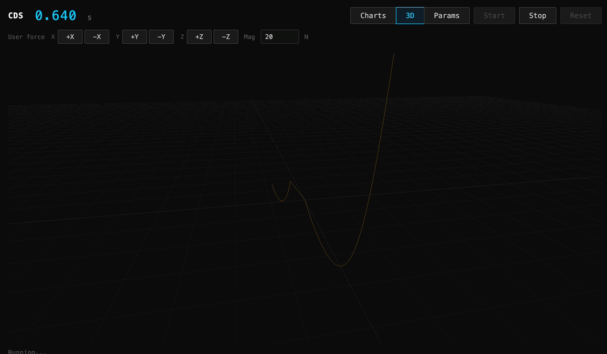
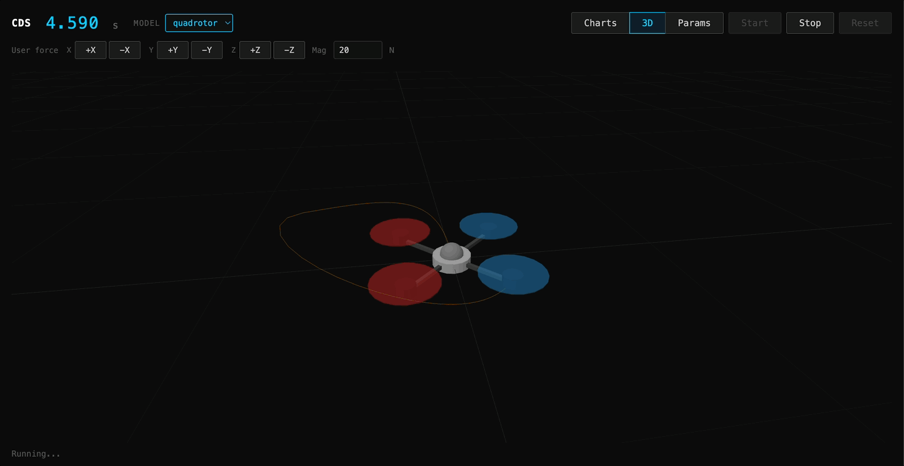
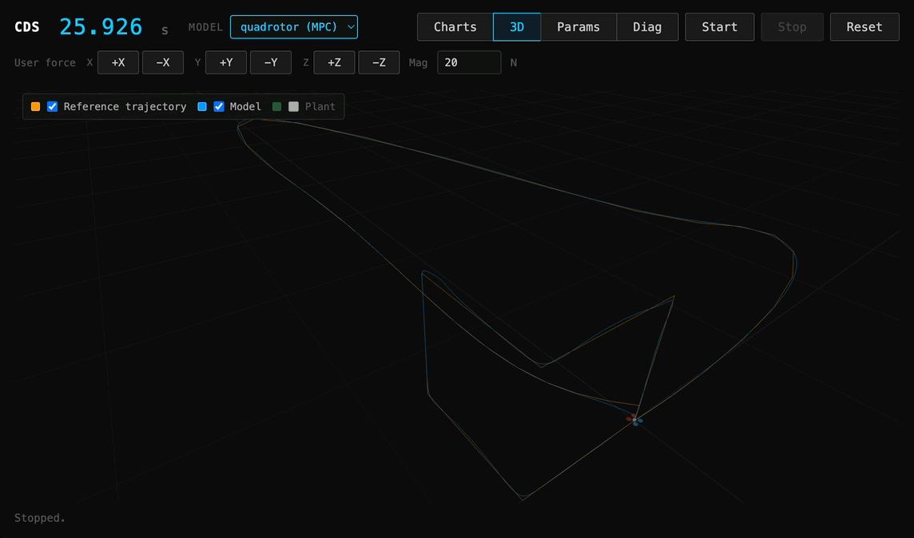
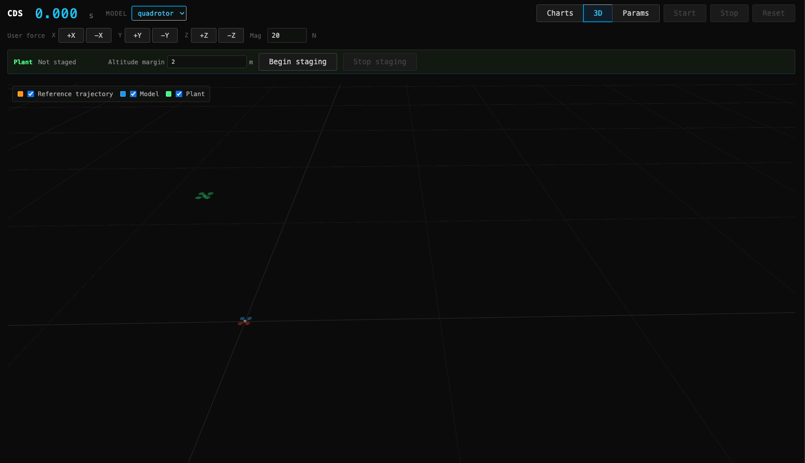
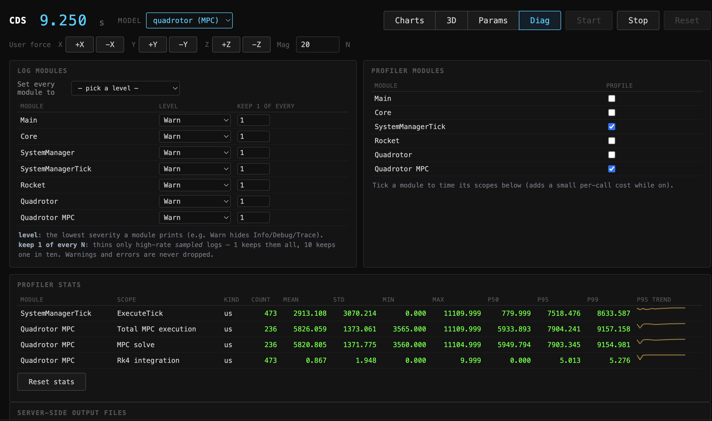
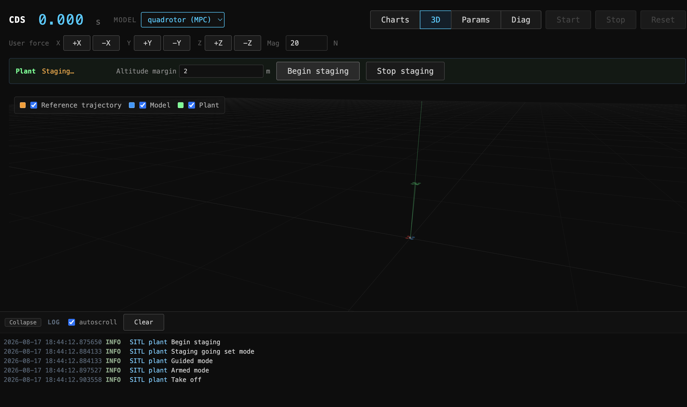

# Controlled Descent Simulator

> A study/portfolio project: an end-to-end workbench for flight control —
> from a vehicle's dynamics derived symbolically in a notebook, to a
> hand-written or generated controller, to a simulated vehicle flown over
> MAVLink.

A vehicle's dynamics are derived in a Jupyter/SymPy
notebook and **generated as C++**; a controller (LQR + feedforward, or a
nonlinear MPC) flies it; and the result can be checked against an external
vehicle driven over MAVLink (ArduPilot SITL today; a real Pixhawk is on the
[roadmap](#roadmap)). The same C++ core runs two ways: compiled to
**WebAssembly** and embedded in the page, or natively inside a **WebSocket
server** with the browser as a thin client.

It is a learning and portfolio project, it is a work in progress.

**[▶ Live Demo](https://diego-perazzolo.github.io/Controlled-Descent-Simulator/frontend/)**



---

## Highlights

- **Three vehicle models**, switchable at runtime — a **Rocket** (Euler-angle
  powered descent, Falcon 9 style), a **QuadRotor** (quaternion 6-DOF), and the
  same **QuadRotor driven by a nonlinear MPC**.
- **Two controller families** — parametric **LQR + differential-flatness
  feedforward**, generated as C++ from the notebooks; and a
  control-limited **nonlinear MPC** (iLQR/DDP) with a C++↔Python conformance
  certificate.
- **Notebook → C++ codegen** — model dynamics and LQR gains are generated from
  Jupyter/SymPy, so the symbolic model and the running code cannot drift apart.
- **A real plant abstraction** — a loopback test double, and an **ArduPilot
  SITL** plant over MAVLink 2 / UDP with auto arm/takeoff staging, shown as a
  translucent "ghost" next to the ideal model. *(Plants are only available in
  the client+server deployment — see below.)*
- **One core, two deployments** — the whole simulator compiled into the page
  (WASM-only), or the core running natively behind a WebSocket server with the
  browser as a ~22 KB thin client. **The plant / SITL / hardware path exists
  only in the client+server deployment**, because it needs the native core.
- **Built-in diagnostics** — a deferred-format logger, a wait-free profiler and
  a black-box data recorder, all off by default and compile-out-able, with
  their cost tracked by a CI benchmark.

---

## The models

### Rocket — powered descent

Single-stage booster in powered descent, Euler-angle attitude, LQR +
feedforward on tracking error. This is the project's namesake maneuver.



### QuadRotor — quaternion 6-DOF

Full quaternion attitude (no gimbal singularities), differential-flatness
feedforward with a heading-frame LQR correction, QuadX rotor allocation.



### QuadRotor (MPC) — nonlinear model-predictive control

The same quadrotor, flown by a control-limited **iLQR/DDP** MPC that
re-optimizes the 4 motor thrusts over a receding horizon, honoring the actuator
box natively instead of clipping after the fact.



### Plant in the loop — ArduPilot SITL

In the client+server deployment, the trajectory can be flown by an external
vehicle (an ArduCopter SITL over MAVLink), mirrored back as a ghost so the ideal
model and the real controller can be compared side by side. See
[docs/sitl.md](docs/sitl.md).



Full state vectors, forces, integration and controller details are in
**[docs/models.md](docs/models.md)**.

---

## Performance at a glance

One physics tick, on a developer laptop, as orders of magnitude:

| model | typical tick |
|-------|-------------:|
| Rocket (feed-forward + LQR) | **~0.4 µs** |
| QuadRotor (feed-forward + LQR) | **~0.9 µs** |
| QuadRotor **MPC** | **~0.5 µs / ~5 ms** *(bimodal: held command vs. full solve)* |

The diagnostics are built to disappear when off: a filtered log line costs
**~1 ns** (its arguments are not even evaluated), a disabled profiler scope
**~5 ns**, a recorder row **~0.6 ns** — and all three can be compiled out
entirely. Methodology, the on-cost of each, and wasm-only vs ws-served overhead
are in **[docs/benchmark.md](docs/benchmark.md)**.

The profiler, recorder and logger surface in the UI as well:

| Diagnostics | Logs |
|:-----------:|:----:|
|  |  |

---

## Architecture

```
┌─────────────────────────────────────────────────────────┐
│                  FRONTEND (HTML + JS)                   │
│                                                         │
│  ┌─────────────┐  ┌─────────────┐  ┌─────────────────┐  │
│  │ Charts view │  │   3D view   │  │   Params tab    │  │
│  │  (canvas)   │  │ (Three.js)  │  │  (form + Apply) │  │
│  └──────┬──────┘  └──────┬──────┘  └────────┬────────┘  │
│         └────────────────┼──────────────────┘           │
│              renderers[].update(state, err)             │
└──────────────────────────┬──────────────────────────────┘
                           │  ext_rocketInit() / ext_quadRotorInit(),
                           │  ext_setSystemParams(), ext_run() / ext_stop(),
                           │  ext_getSnapshot(), ext_getPlantSnapshot(),
                           │  ext_trajectory_...()
                           ▼
┌─────────────────────────────────────────────────────────┐
│                   SIMULATOR (.wasm)                     │
│                                                         │
│  ┌───────────────────────────────────────────────────┐  │
│  │          apps/ — Communication Layer              │  │
│  │   embind bindings · struct conversion · errors    │  │
│  └───────────────────────┬───────────────────────────┘  │
│                          │                              │
│  ┌───────────────────────▼───────────────────────────┐  │
│  │             Core (C++) — SystemManager            │  │
│  │ ┌────────┐  ┌───────┐  ┌──────────┐  ┌──────────┐ │  │
│  │ │ Models │  │ Plant │  │Controller│  │Trajectory│ │  │
│  │ │Rkt/Quad│  │mailbox│  │FF/LQR/MPC│  │ Manager  │ │  │
│  │ └────────┘  └───────┘  └──────────┘  └──────────┘ │  │
│  └───────────────────────┬───────────────────────────┘  │
│                          │                              │
│  ┌───────────────────────▼───────────────────────────┐  │
│  │                   Dynamics                        │  │
│  │  ┌──────────┐   ┌────────────┐   ┌────────────┐   │  │
│  │  │ Jupyter  │   │ Generated  │   │ Controller │   │  │
│  │  │ notebook │   │    C++     │   │   design   │   │  │
│  │  └──────────┘   └────────────┘   └────────────┘   │  │
│  └───────────────────────────────────────────────────┘  │
│                                                         │
└─────────────────────────────────────────────────────────┘
```

In the **ws-served** deployment the "SIMULATOR" block runs natively inside
`cds_server` instead of in the page, and the frontend reaches it through a thin
WASM proxy over WebSocket. The **SystemManager** owns the model, trajectory and
plant behind one lock, and every real-time tick drives the plant exchange and
the physics integration in order. Details in [docs/build.md](docs/build.md).

---

## Documentation

| Doc | What's in it |
|-----|--------------|
| [docs/build.md](docs/build.md) | Build & run, prerequisites, app switching, notebook setup, deployment |
| [docs/api.md](docs/api.md) | The `ext_*` communication API — functions, structs, JS usage |
| [docs/models.md](docs/models.md) | Physics & control reference — state vectors, forces, controllers |
| [docs/sitl.md](docs/sitl.md) | Flying against an ArduPilot SITL in Docker, end to end |
| [docs/benchmark.md](docs/benchmark.md) | Performance and the cost of the diagnostics |
| [AGENTS.md](AGENTS.md) | Conventions, invariants and verification commands |

The frontend talks to the core through a small C-style API (init, system params,
run / stop, snapshot, trajectory composition), identical for every app and
exposed to JavaScript via embind — see [docs/api.md](docs/api.md).

---

## Tech stack

| Layer | Technology |
|---|---|
| Modeling & codegen | Python (Jupyter / SymPy) |
| Physics core & dynamics | C++20 |
| WASM compilation | Emscripten (`emcc`) |
| JS bindings | Emscripten `embind` |
| Frontend | Vanilla HTML + JS (ES modules) |
| 3D rendering | Three.js |
| Plant transport | MAVLink 2 / UDP (ArduPilot SITL) |
| Build | CMake |
| Deployment | GitHub Pages |

---

## Repository structure

```
/
├── core/        # The physics core (models, controller, trajectory), a static library
├── apps/        # Deployments of the core: common/ (ext API + bindings), wasm-only/, ws-served/
├── libs/        # In-house infrastructure (sync, ws, integrate: RK4, control: iLQR/MPC solver)
├── plants/      # External-vehicle plants: loopback + ArduPilot SITL over MAVLink
├── frontend/    # Shared web UI — runs whichever app was built last into build/
├── modeling/    # Jupyter/SymPy notebooks + C++ code generation
├── bench/       # Native micro-benchmarks (per-model tick + diagnostics cost)
├── tools/       # Dev utilities (serve.py: COOP/COEP dev server)
└── docs/        # Documentation and media
```

The full annotated tree is in [docs/build.md](docs/build.md#repository-structure).

---

## Quickstart

The in-browser (WASM-only) app, no server required:

```bash
emcmake cmake -S apps/wasm-only -B build-wasm-only -DCMAKE_BUILD_TYPE=Release
cmake --build build-wasm-only
python3 tools/serve.py 8080
```

Then open `http://localhost:8080/frontend/` in the browser.

The **client+server** app (native core + WebSocket thin client — required for
the plant / SITL path), prerequisites, app switching, notebook setup and
deployment are all in **[docs/build.md](docs/build.md)**.

---

## Roadmap

- [x] C++ core: 6 DOF models + RK4 integrator (Rocket: Euler angles, QuadRotor: quaternion)
- [x] LQR controller with feedforward (differential flatness for the QuadRotor)
- [x] Customizable trajectory composition (with yaw setpoints)
- [x] Notebook-driven C++ code generation (shared codegen base, per-model generators)
- [x] ws-served app: core on a native WebSocket server, browser as thin client
- [x] SITL plant over MAVLink/UDP (ArduCopter): link, telemetry, Guided-mode setpoints, auto arm/takeoff staging
- [x] Save / load of parameters and trajectories from the frontend
- [x] Nonlinear model-predictive control (control-limited iLQR/DDP) for the QuadRotor: shared C++ solver (`libs/control`) with a Python reference and conformance certificate
- [ ] Real hardware interface (MAVLink over serial to a Pixhawk): the SITL plant's link layer is the same, only the transport changes

---

## Author

Diego Perazzolo — system design, physics/control modeling, architecture and all
engineering decisions.

Built with Claude (Claude Code) as an AI pair-programmer used across the whole
stack — C++ core, SITL plant, frontend, docs and code review — under the
author's direction and review.

---

## License

MIT — see [LICENSE](LICENSE) for details.
