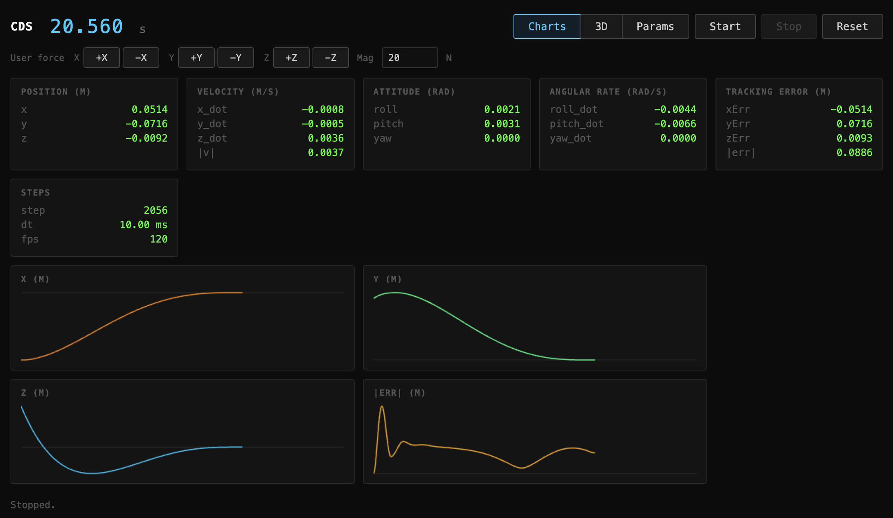
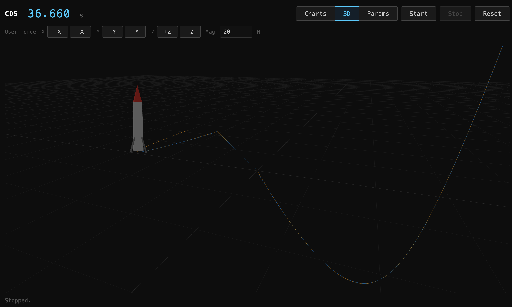
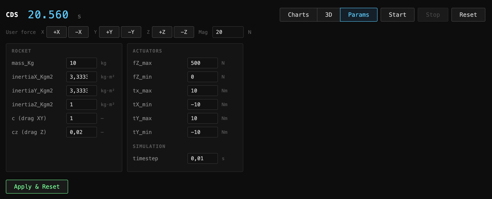
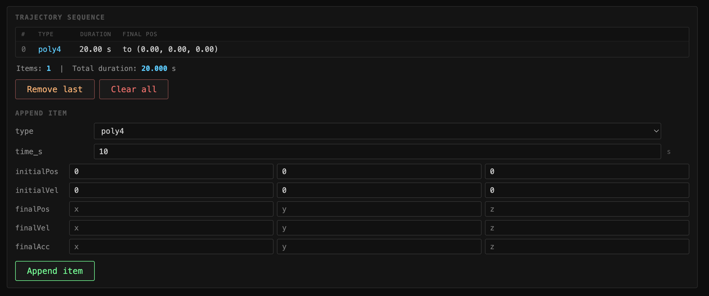

# Controlled Descent Simulator

A real-time, interactive simulator of **controlled flight and descent**, built with a C++ physics core compiled to **WebAssembly** and a vanilla JS frontend. Runs entirely in the browser — no server required. Alternatively, the same core can run natively in a **WebSocket server** (`cds_server`) with the browser acting as a thin client; each deployment is an app under `apps/` selected at build time (see [docs/build.md](docs/build.md)).

Two vehicle models are available, selectable at runtime:
- **Rocket** — powered descent of a single-stage booster (SpaceX Falcon 9 style)
- **QuadRotor** — quaternion-based 6-DOF quadrotor with differential-flatness feedforward

**[Live Demo](https://diego-perazzolo.github.io/Controlled-Descent-Simulator/frontend/)**


---

## Project Scope

Simulate the controlled 3D flight of a rocket booster and of a quadrotor, with:
- A **dynamics modeling notebook** per vehicle (Jupyter/SymPy), with C++ code generation
- A **physics core** written in C++20, compiled to `.wasm` via Emscripten
- A **plain HTML/JS frontend** for real-time visualization, parameter configuration, and interactive control
- Full deployment on **GitHub Pages** 

---

## Features

### Frontend

- **Model selector** — switch between Rocket and QuadRotor at runtime; each model has its own parameter panel
- **Charts view** — real-time strip charts for x, y, z position, yaw attitude and position error magnitude
- **3D view** — Three.js scene with vehicle mesh (rocket: body + nose cone + landing legs; quadrotor: frame + rotors), trajectory trail, orbital camera (orbit / pan / zoom)
- **3D view source toggles** — reference trajectory, model vehicle and plant ghost (translucent, with its own trail) can be shown in any combination; the plant toggle enables itself only while fresh plant snapshots are available
- **Params tab** — edit all physical and trajectory parameters at runtime; Apply & Reset re-initializes the core without reloading the page
- **User force buttons** — six hold-to-apply buttons (±X, ±Y, ±Z) inject external perturbation forces, pushed to the backend tick thread in real time on press / release; force magnitude is configurable
- **Simulation controls** — Start / Stop / Reset
- **Live simulation time** display

### Core (C++ — in-browser WASM or native server)

#### Communication Layer (`apps/common`)
- `ext_rocketInit(params)` — initializes the Rocket model with parameters and actuator limits
- `ext_quadRotorInit(params)` — initializes the QuadRotor model with parameters and actuator limits
- `ext_setSystemParams(params)` — sets the tick period and user forces used by the backend tick thread
- `ext_run()` / `ext_stop()` — start / stop the simulation; integration advances on a backend tick thread
- `ext_getSnapshot()` — returns the simulated time, full state and tracking errors (position + yaw)
- `ext_getPlantSnapshot()` — returns the plant's last sample: plant-side time, sequence number, state and readiness (`isReadyToStart`); freshness is detected by comparing sequence numbers between polls
- `ext_beginStaging(safetyAltitude)` / `ext_stopStaging()` — auto-stage the plant to a hover at (trajectory vertical range + `safetyAltitude` m) via GUIDED → arm → takeoff → climb, and abort it
- `ext_trajectory_get_point(timeInstant)` - provides a point along the reference trajectory, used for trajectory preview
- `ext_trajectory_append_poly4(params)` - appends a trajectory of type polynomial 4th order, configured with total time for the maneuver, initial/final position, velocity, acceleration and yaw
- `ext_trajectory_append_point(params)` - appends a trajectory of type point, configured with a final position, a final yaw and the total time needed for the maneuver
- `ext_trajectory_remove_last_item(void)` - removes the last trajectory item from the trajectory list
- Emscripten `embind` bindings expose all structs and functions to JavaScript

#### System orchestration
- **SystemManager** — single owner of model, trajectory and plant behind one lock; every tick of the real-time thread drives, in order, the plant exchange and the physics integration. Model and plant are orchestrated symmetrically: the model is the simulated vehicle, the plant is an external one (SITL/HIL) observed through the same state interface
- **Plant subsystem** — `BasePlant` exchanges commands/measurements with the tick through wait-free latest-wins mailboxes (`libs/sync` TripleBuffer); samples carry sequence numbers and plant-side timestamps, so staleness, dropouts and latency are observable. The plant lifecycle is two-phase: the link lives from attach to detach (`Connect`/`Disconnect`), the mission runs between `Run` and `Stop` (`Start`/`Stop`). Two implementations ship under `plants/` (selected in the server, see [docs/build.md](docs/build.md)):
  - **loopback** — echoes the commanded reference back as measured state, with configurable sample period, latency and dropout rate; the plumbing test double
  - **SITL (ArduCopter)** — drives an ArduPilot Copter SITL over MAVLink 2 / UDP: telemetry (`LOCAL_POSITION_NED` + `ATTITUDE`) comes back as measurements, the trajectory reference streams out as `SET_POSITION_TARGET_LOCAL_NED` Guided-mode setpoints. The NED↔ENU frame conversion is confined to the plant, the MAVLink headers are vendored and version-pinned, and the frame is aligned to the trajectory start at mission Start. **Auto-staging** brings the vehicle up to a stable hover (GUIDED → arm → takeoff → climb to the trajectory's vertical range plus a safety margin; if already airborne it climbs in place instead of taking off) and Start is gated until it is staged. Mission stop / detach commands a safety hold in place. For the end-to-end walkthrough against a SITL in Docker, see [docs/sitl.md](docs/sitl.md)

#### Physics Engine
- **6 DOF rigid body dynamics** (3 translational + 3 rotational) for both models
- **Rocket** — Euler-angle attitude; augmented state with 4 error integrators (x, y, z, yaw); inputs: main thrust + 3 torques
- **QuadRotor** — quaternion attitude (13 physical states) + 4 error integrators; inputs: 4 per-rotor thrusts (QuadX allocation); differential-flatness feedforward with heading-frame LQR correction
- Forces: thrust, gravity, aerodynamic drag (parametric coefficients `c`, `cz`), user-injected perturbations
- ODE integration: **Runge-Kutta 4 (RK4)**
- Parametric controller (LQR with FF on all actuators, actuator saturation)
- Model dynamics and controller gains are **generated as C++** from the Jupyter notebooks

### Screenshots

| Charts view | 3D view | Physics params view | Trajectory params view |
|:-----------:|:-------:|:-------:|:-------:|
|  |  |  |  |

---

## Software Architecture

```
┌─────────────────────────────────────────────────────────┐
│                  FRONTEND (HTML + JS)                   │
│                                                         │
│  ┌─────────────┐  ┌─────────────┐  ┌─────────────────┐  │
│  │ Charts view │  │   3D view   │  │   Params tab    │  │
│  │  (canvas)   │  │ (Three.js)  │  │  (form + Apply) │  │
│  └──────┬──────┘  └──────┬──────┘  └────────┬────────┘  │
│         └────────────────┼──────────────────┘           │
│              renderers[].update(state, err)             │
└───────────────────────────┬─────────────────────────────┘
                            │  ext_rocketInit() / ext_quadRotorInit(),
                            │  ext_setSystemParams(), ext_run() / ext_stop(),
                            │  ext_getSnapshot(), ext_getPlantSnapshot(),
                            │  ext_trajectory_...()
                            ▼
┌─────────────────────────────────────────────────────────┐
│                   SIMULATOR (.wasm)                     │
│                                                         │
│  ┌───────────────────────────────────────────────────┐  │
│  │          apps/ — Communication Layer              │  │
│  │   embind bindings · struct conversion · errors    │  │
│  └──────────────────────┬────────────────────────────┘  │
│                         │                               │
│  ┌──────────────────────▼────────────────────────────┐  │
│  │             Core (C++) — SystemManager            │  │
│  │ ┌────────┐  ┌───────┐  ┌──────────┐  ┌──────────┐ │  │
│  │ │ Models │  │ Plant │  │Controller│  │Trajectory│ │  │
│  │ │Rkt/Quad│  │mailbox│  │ FF + LQR │  │ Manager  │ │  │
│  │ └────────┘  └───────┘  └──────────┘  └──────────┘ │  │
│  └──────────────────────┬────────────────────────────┘  │
│                         │                               │
│  ┌──────────────────────▼────────────────────────────┐  │
│  │                   Dynamics                        │  │
│  │  ┌──────────┐   ┌────────────┐   ┌────────────┐   │  │
│  │  │ Jupyter  │   │ Generated  │   │ Controller │   │  │
│  │  │ notebook │   │    C++     │   │   design   │   │  │
│  │  └──────────┘   └────────────┘   └────────────┘   │  │
│  └───────────────────────────────────────────────────┘  │
│                                                         │
└─────────────────────────────────────────────────────────┘
```

---

## Physics Model

### Degrees of Freedom
6 DOF rigid body (both models):
- **Translational**: X, Y, Z position and velocity in inertial frame
- **Rotational**: Rocket uses Euler angles; QuadRotor uses a unit quaternion

### State

**Rocket** (12 physical + 4 integrators):
```
x, y, z                       — position (m)
alpha, beta, psi              — Euler angles (rad)
x_dot, y_dot, z_dot           — linear velocity (m/s)
alpha_dot, beta_dot, psi_dot  — angular rates (rad/s)
IntX, IntY, IntZ, IntPsi      — tracking-error integrators
```

**QuadRotor** (13 physical + 4 integrators):
```
x, y, z                   — position (m)
qw, qx, qy, qz            — attitude quaternion
vx, vy, vz                — linear velocity (m/s)
wx, wy, wz                — body angular rates (rad/s)
IntX, IntY, IntZ, IntPsi  — tracking-error integrators
```

### Forces and Torques
- **Rocket**: main thrust + 3 control torques; **QuadRotor**: 4 per-rotor thrusts mapped to collective thrust + 3 torques (QuadX allocation)
- Gravity: `F_g = m·g` along −Z
- Aerodynamic drag: lateral coefficient `c`, axial coefficient `cz`
- External perturbations: user-injected force vector `(fX, fY, fZ)`

### Integration
Runge-Kutta 4 (RK4); the step `dt` is provided by the backend tick thread
(wall-clock paced at the configured tick period, clamped after stalls).

### Controller
LQR on tracking error (position + yaw, with error integrators), feedforward on all actuators (differential flatness for the QuadRotor), actuator saturation; all derived in the Jupyter notebooks and exported as C++

---

## Core API

The frontend talks to the core through a small C-style API (init, system
params, run / stop, snapshot, trajectory composition), identical for every
app and exposed to JavaScript via embind. Functions, types and JS usage are documented in
**[docs/api.md](docs/api.md)**.

---

## Tech Stack

| Layer | Technology |
|---|---|
| Modeling | Python |
| Dynamics | C++20 |
| Physics core | C++20 |
| WASM compilation | Emscripten (`emcc`) |
| JS bindings | Emscripten `embind` |
| Frontend | Vanilla HTML + JS (ES modules) |
| 3D rendering | Three.js |
| Build | CMake |
| Deployment | GitHub Pages |

---

## Repository Structure

```
/
├── core/        # The physics core (models, controller, trajectory), a static library
├── apps/        # Deployments of the core: common/ (ext API + bindings), wasm-only/, ws-served/
├── libs/        # In-house infrastructure libraries (ws: WebSocket RPC transport)
├── frontend/    # Shared web UI — runs whichever app was built last into build/
├── modeling/    # Jupyter/SymPy notebooks + C++ code generation
├── tools/       # Dev utilities (serve.py: COOP/COEP dev server)
└── docs/        # Documentation and media
```

The full annotated tree is in [docs/build.md](docs/build.md#repository-structure).

---

## Quickstart

```bash
emcmake cmake -S apps/wasm-only -B build-wasm-only -DCMAKE_BUILD_TYPE=Release
cmake --build build-wasm-only
python3 tools/serve.py 8080
```

Then open `http://localhost:8080/frontend/` in the browser.

Prerequisites, the ws-served app (native core server + WebSocket thin
client), app switching, notebook setup and deployment are documented in
**[docs/build.md](docs/build.md)**.

---

## Future Steps

- [x] C++ core: 6 DOF models + RK4 integrator (Rocket: Euler angles, QuadRotor: quaternion)
- [x] LQR controller with feedforward (differential flatness for the QuadRotor)
- [x] Customizable trajectory composition (with yaw setpoints)
- [x] Notebook-driven C++ code generation (shared codegen base, per-model generators)
- [x] ws-served app: core on a native WebSocket server, browser as thin client
- [x] SITL plant over MAVLink/UDP (ArduCopter): link, telemetry, Guided-mode setpoints, auto arm/takeoff staging
- [ ] Save / load of parameters and trajectories from the frontend
- [ ] Real hardware interface (MAVLink over serial to a Pixhawk): the SITL plant's link layer is the same, only the transport changes

---

## Author

Diego Perazzolo — system design, physics/control modeling, architecture and
all engineering decisions.

Built with Claude (Claude Code) as an AI pair-programmer used across the whole
stack — C++ core, SITL plant, frontend, docs and code review — under the
author's direction and review.

---

## License

MIT — see [LICENSE](LICENSE) for details.
